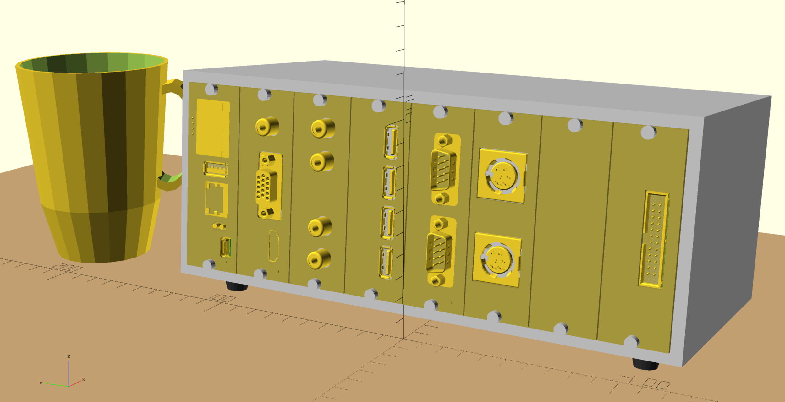

# Ashet Home Computer Mk4

### _The 21st century home computer_

| Project Status                                                                                       |
|------------------------------------------------------------------------------------------------------|
| ⚠️ **WORK IN PROGRESS** ⚠️                                                                             |
| This README reflects the state of where the project wants to go, not where the project is right now! |

## Introduction

The Ashet Home Computer bridges the gap between simple microcontroller development boards and modern single-board computers, offering the processing capability to run a full graphical desktop OS while maintaining the hardware accessibility of simpler systems.

Built around the RP2350 dual-core processor, it combines sufficient computational power for a modern user interface with a transparent, education-oriented architecture. The modular expansion system, inspired by classic computer designs, allows direct hardware access while providing proper driver abstractions for portability.

Key differentiators:

- Runs [Ashet OS](https://github.com/Ashet-Technologies/Ashet-OS): A custom desktop operating system with modern GUI capabilities
- Fully documented hardware architecture with direct register access
- Modular expansion through 7 dedicated slots, including specialized video/audio interfaces
- 8 MB RAM and 16 MB Flash supporting both low-level and high-level development
- Comprehensive I/O capabilities suitable for real-time interfacing, creative projects, and systems development

The system is designed for accessibility across different skill levels - from students learning computer architecture to makers building custom hardware interfaces, and from demosceners pushing hardware limits to educators teaching system design.

## Features

The computer follows a modular design similar to a PC where you have expansion cards that you can plug into the system.

### Core Features

These features are available no matter what expansion cards you have installed.

- RP2350 Core
  - Dual-Core System
  - Each Core Might Be
    - Arm CPU (Cortex-M33, 150 MHz)
    - RISC-V CPU (RV32IMAC+, 150 MHz)
- 8 MB RAM
- 16 MB Flash
- USB 1.1 Host
- 10/100 Mbps Ethernet
- Battery-Backed Real-Time Clock
- Status Display (128x64, monochrome)
- Integrated Debug Probe
- 7 Expansion Slots
  - 1 Video Expansion Slot
  - 1 Audio Expansion Slot
  - 5 Generic Expansion Slots

### Standard Expansions

The following expansion cards are the designated expansion cards which make up the Ashet Home Computer as designed:

1. [Framebuffer Video Card](Hardware/Expansions/Framebuffer%20Video/README.md)
    - DVI Video Out (800x480, 60 Hz)
2. [PCM Sound Card](Hardware/Expansions/PCM%20Sound/README.md)
    - PCM Audio Out (48 kHz, 16 bit)
    - PCM Audio In (48 kHz, 16 bit)
3. [USB Card](Hardware/Expansions/USB/README.md)
    - 4 USB 1.1 Host Ports
4. [RS232 Card](Hardware/Expansions/RS232/README.md)
    - TTL UART (3.3V, 5V, ±12V)
5. [Basic I/O Card](Hardware/Expansions/Basic%20IO/README.md)
    - Pin Header Connector
    - 8 GPIOs
    - Dedicated I²C
    - 5 V and 3.3 V power supply available
6. [Commodore Connectivity Card](Hardware/Expansions/Commodore%20Connectivity/README.md)
    - 2× C64 Serial
7. [User Expansion Card](Hardware/Expansions/User%20Expansion/README.md)
    - Minimal Expansion Card
    - Perfboard For Custom Expansions
    - Pin Header Connector

### Other Expansions

There are many more ideas that can be realized with expansion cards.

Take a peek at our [List of Expansion Board Ideas](Concept/Expansion%20Boards.md) or check out the [Expansion Card Interface Specification](Specs/Expansion%20Bus.md) how to create your own.

## Use Cases

This chapter contains a list of things you can do with the computer, ordered loosely by user groups.

### Demosceners

Make a demo, I guess?

With a good audio and video expansion card, and two strong multi-core CPUs the computer packs enough power to create awesome visuals and sound effects.

### Retro-Enthusiasts

The computer is able to emulate a lot of existing machines with fitting I/O connectivity. The backplane is able to emulate a lot of different protocols with cheap passive expansion modules.

It also is able to create a multitude of video signals, analog and digital with 15 or 30 kHz line frequency. Another option is to have more complex expansion cards which can drive storage interfaces like [Shugart bus](https://en.wikipedia.org/wiki/Floppy_disk_drive_interface), [MFM disks](https://en.wikipedia.org/wiki/Modified_frequency_modulation), ATA and IDE…

### Artists / Musicians

The Ashet can be used as a cheap real-time sequencing controller which can handle a good amount of interfaces. With support for MIDI, DMX, analog audio channels and ethernet, it's possible to create complex audio setups. Another option is creating or using expansion cards that provide access to old-school synthesizers like the [AY-3-8910](https://en.wikipedia.org/wiki/General_Instrument_AY-3-8910) or the [SID](https://en.wikipedia.org/wiki/MOS_Technology_6581).

### Hackers / Makers

With the Propeller 2 on the backplane, one can basically emulate any digital interface like SPI or I²C. With a breakout I/O expansion card, it can be used for controlling your own hardware, accessing and changing SPI flashes, ...

It is also possible to use the Ashet as a basic logic analyzer and scope, as well as a signal and waveform generator. With a bigger I/O card, it can be expanded to 32 synchronously processed channels.

By utilizing a scripting language on Ashet OS, one should be able to easily access and bootstrap newly acquired hardware.

### Educators

The project provides extensive documentation, from decision making over the schematic up to the software architecture, so it can be used as an example on how to design a complete computer system.

The machine also looks more like a "real computer" than a Raspberry Pi or other modern single-board computers, so it is more tangible for persons that do not have experience with electronics and might give an easier start.

### Students

The computer provides a good hands-on experience and allows both creating or understanding hardware and software designs and how they play together. The system is also easily expansible and thus allows creating custom hardware modules. The available documentation allows learning basically everything about the computer that is possible to know.

## Comparison with Similar Projects

The following table shows a comparison to other "small" computers. It should help you get an idea where the Ashet Home Computer is in relation to other projects.

| Feature                      | Ashet                                                              | [Raspberry Pi 4](https://www.raspberrypi.com/products/raspberry-pi-4-model-b/specifications/)   | [Arduino Uno REV3](https://store.arduino.cc/products/arduino-uno-rev3) | [Neotron Pico](https://github.com/neotron-Compute/neotron-Pico)                                                                   | [Cody Computer](https://www.codycomputer.org/)          |
|------------------------------|--------------------------------------------------------------------|-------------------------------------------------------------------------------------------------|------------------------------------------------------------------------|-----------------------------------------------------------------------------------------------------------------------------------|---------------------------------------------------------|
| CPU Architecture             | Arm Cortex-M33 (32 bit)                                            | Arm Cortex-A72 (64 bit)                                                                         | ATmega328p (8 bit)                                                     | Arm Cortex-M0+ (32 bit)                                                                                                           | 6502                                                    |
| CPU Model                    | [Rapsberry Pi RP2350](https://www.raspberrypi.com/products/rp2350/) | [Broadcom BCM2711](https://www.raspberrypi.com/documentation/computers/processors.html#bcm2711) | [ATmega328P](https://www.microchip.com/en-us/product/atmega328p)       | [Rapsberry Pi RP2040](https://www.raspberrypi.com/products/rp2040/)                                                               | [W65C02S](https://wdc65xx.com/integrated-circuit)       |
| CPU Cores                    | 2                                                                  | 4                                                                                               | 1                                                                      | 2                                                                                                                                 | 1                                                       |
| CPU Clock                    | 150 MHz                                                            | 1.8 GHz                                                                                         | 16 MHz                                                                 | 133 MHz                                                                                                                           | 1 MHz                                                   |
| System Memory                | 8 MB                                                               | 1, 2, 4 or 8 GB                                                                                 | 2 KB                                                                   | 264 kB                                                                                                                            | 64 kB                                                   |
| Understandable               | ✅                                                                  | ❌                                                                                               | ✅                                                                      | ✅                                                                                                                                 | ✅                                                       |
| Modern I/O                   | ✅                                                                  | ✅                                                                                               | ❌                                                                      | ❌¹                                                                                                                                | ❌                                                       |
| Modular Design               | ✅                                                                  | ❌                                                                                               | ❌                                                                      | ✅                                                                                                                                 | ✅²                                                      |
| Full Documentation Available | ✅                                                                  | ❌                                                                                               | ✅                                                                      | ✅                                                                                                                                 | ✅                                                       |
| Ethernet                     | ✅                                                                  | ✅                                                                                               | ❌                                                                      | ❌                                                                                                                                 | ❌                                                       |
| Parallax Propeller I/O Chip  | ✅ ([Propeller 2](https://www.parallax.com/propeller-2))            | ❌                                                                                               | ❌                                                                      | ❌                                                                                                                                 | ✅ ([Propeller 1](https://www.parallax.com/propeller-1)) |

¹Neotron Pico uses PS/2 for mouse/keyboard and VGA for video.

²Cody Computer has a single cartridge that can be added.

## Architecture

### Block Diagram

## Glossary

<dl>
  <dt>Mainboard</dt>
  <dd>The Mainboard houses the cpu core and everything necessary to run the system, even without <em>Expansion Boards</em> or the <em>Backplane</em>.</dd>

  <dt>Backplane</dt>
  <dd>The Backplane is the interconnect between the <em>Mainboard</em> and <em>Expansion Boards</em>. This board also contains the <em>I/O Southbridge</em></dd>

  <dt>Expansion Board</dt>
  <dd>Expansion Boards provide more capabilities to the computer. They usually add more I/O features, but could also house any other kind of electronics that want to interface with the <em>Mainboard</em>.</dd>

  <dt>Video Expansion Board</dt>
  <dd>A Video Expansion Board is a special expansion that is only installable in a single socket of the <em>Backplane</em>. In addition to the generic <em>Expansion Board</em> interface, it has an additional 8 lanes of high-speed interconnect to the <em>Mainboard</em>.</dd>

  <dt>Audio Expansion</dt>
  <dd>An Audio Expansion Board is a special expansion that is only installable in a single socket of the <em>Backplane</em>. In addition to the generic <em>Expansion Board</em> interface, it has an additional 2-lane I²S interconnect to the <em>Mainboard</em>.</dd>

  <dt>I/O Southbridge</dt>
  <dd>The I/O Southbridge provides the main interconnect between the <em>Main Board</em> and the <em>Expansion Boards</em>. It is realized by a <a href="https://www.parallax.com/propeller-2/">Propeller 2</a>.</dd>
</dl>
